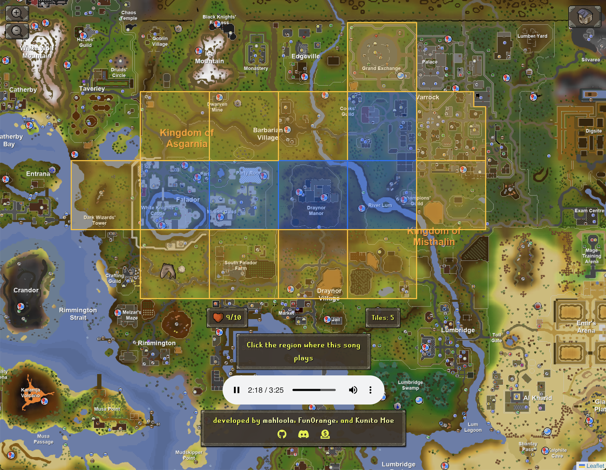

> **This is a fork of [mahloola/Jingle](https://github.com/mahloola/Jingle) that adds the Map Traversal game mode.**

[](https://jingle.rs)

## Map Traversal

A new game mode where you explore the OSRS map one region at a time. You start on a random tile and hear a song from a neighboring region — click where you think it plays to expand your territory. Wrong guesses cost a life. Every 5 correct guesses a shark spawns on the frontier that heals 1 HP if you land on it. Keep going until you run out of lives or unlock the entire map.



[Try it out](https://jingle-traversal.vercel.app/traversal) | For a full breakdown of the rules and how it was built, see [Map Traversal - Deep Dive](docs/MAP_TRAVERSAL.md).

## Gameplay

[Jingle](https://jingle.rs) is a GeoGuessr-inspired music guessing game for Oldschool RuneScape - the goal is to drop a pin on the map at the location where the current OSRS song is played in-game.

At the moment, there are two modes:

- Practice Mode (unlimited)
- Daily Jingle (a global daily challenge consisting of 5 songs)

The Daily Jingle resets at 00:00 in London, UK (GMT/BST)

## Running Locally

```bash
npm install
npm run dev
```

## Development

I opened a [Discord](https://discord.gg/AR2FDmWggU) for suggestions/issues, as well as pull request guidance.

<center>


</center>

## Demo

https://github.com/mahloola/osrs-music/assets/61226619/8fab475a-db16-4d2e-b123-5d2967c63c1e
